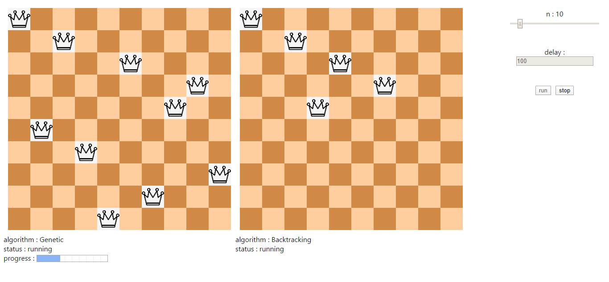

# N-Queens Problem Simulator
I simulated n-queens problem with two algorithms : **Backtracking** and **Genetic Algorithm** using javascript language

This project helps you to see the process of solving n-queens problem using the two mentioned algorithms and compare the performance.

# JS Files Explanation
1. **js/genetic-tools.js** : A light-weight tool box for genetic algorithm contains several methods.
2. **js/chess-ui.js** : A Chess UI generator which takes an object of Engine class and visualize that engines steps.
3. **js/n-queens-backtracking-engine.js** : BackTracking engine to solve n-queens problem.
4. **js/n-queens-genetic-engine.js** : Genetic Algorithm based engine to solve n-queens problem.
# Demo
click [here](https://chess.akdev.ir) to see online demo hosted on github pages
